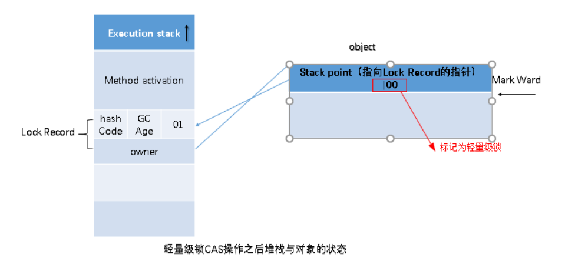
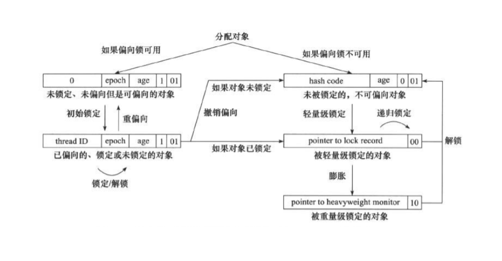

# sychronized关键字详解

[TOC]


> 带着问题学知识

- Synchronized可以作用在哪里? 分别通过对象锁和类锁进行举例。

- Synchronized本质上是通过什么保证线程安全的? 分三个方面回答：加锁和释放锁的原理，可重入原理，保证可见性原理。

- Synchronized有什么样的缺陷?  Java Lock是怎么弥补这些缺陷的。
- Synchronized和Lock的对比，和选择?
- Synchronized在使用时有何注意事项?
- Synchronized修饰的方法在抛出异常时,会释放锁吗?
- 多个线程等待同一个snchronized锁的时候，JVM如何选择下一个获取锁的线程?
- Synchronized使得同时只有一个线程可以执行，性能比较差，有什么提升的方法?
- 我想更加灵活地控制锁的释放和获取(现在释放锁和获取锁的时机都被规定死了)，怎么办?
- 什么是锁的升级和降级? 什么是JVM里的偏斜锁、轻量级锁、重量级锁?
- 不同的JDK中对Synchronized有何优化?


## Synchronized锁的使用

synchronized锁可以分为对象锁，类锁。一个synchronized锁只能由一个线程获得，其他没有获得的线程只能等待；

### 对象锁

使用对象锁有两种方式

1. 在普通方法上加锁
2. 在代码块上加锁，可以给当前对象this加锁，也可以自定义锁

以下是代码实现：

在普通方法上加锁：

```java
public synchronized void method() {
        System.out.println("我是线程" + Thread.currentThread().getName());
        try {
            Thread.sleep(3000);
        } catch (InterruptedException e) {
            e.printStackTrace();
        }
        System.out.println(Thread.currentThread().getName() + "结束");
 }
```

在代码块上加锁，锁对象是this:

```java
public class SynchronizedObjectLock implements Runnable {
    static SynchronizedObjectLock instence = new SynchronizedObjectLock();

    @Override
    public void run() {
        // 同步代码块形式——锁为this,两个线程使用的锁是一样的,线程1必须要等到线程0释放了该锁后，才能执行
        synchronized (this) {
            System.out.println("我是线程" + Thread.currentThread().getName());
            try {
                Thread.sleep(3000);
            } catch (InterruptedException e) {
                e.printStackTrace();
            }
            System.out.println(Thread.currentThread().getName() + "结束");
        }
    }

    public static void main(String[] args) {
        Thread t1 = new Thread(instence);
        Thread t2 = new Thread(instence);
        t1.start();
        t2.start();
    }
}
```

在代码块上加锁，并且自定义锁对象：

```java
public class SynchronizedObjectLock implements Runnable {
    static SynchronizedObjectLock instence = new SynchronizedObjectLock();
    // 创建2把锁
    Object block1 = new Object();
    Object block2 = new Object();

    @Override
    public void run() {
        // 这个代码块使用的是第一把锁，当他释放后，后面的代码块由于使用的是第二把锁，因此可以马上执行
        synchronized (block1) {
            System.out.println("block1锁,我是线程" + Thread.currentThread().getName());
            try {
                Thread.sleep(3000);
            } catch (InterruptedException e) {
                e.printStackTrace();
            }
            System.out.println("block1锁,"+Thread.currentThread().getName() + "结束");
        }

        synchronized (block2) {
            System.out.println("block2锁,我是线程" + Thread.currentThread().getName());
            try {
                Thread.sleep(3000);
            } catch (InterruptedException e) {
                e.printStackTrace();
            }
            System.out.println("block2锁,"+Thread.currentThread().getName() + "结束");
        }
    }

    public static void main(String[] args) {
        Thread t1 = new Thread(instence);
        Thread t2 = new Thread(instence);
        t1.start();
        t2.start();
    }
}

```

### 类锁

类锁的加锁形式有两种：

1. 在静态方法上加关键字synchronized
2. 在方法块上加锁，并且锁对象是当前Class

以下是代码实现：

在静态方法上加关键字synchronized：

```java
   // synchronized用在静态方法上，默认的锁就是当前所在的Class类，所以无论是哪个线程访问它，需要的锁都只有一把
    public static synchronized void method() {
        System.out.println("我是线程" + Thread.currentThread().getName());
        try {
            Thread.sleep(3000);
        } catch (InterruptedException e) {
            e.printStackTrace();
        }
        System.out.println(Thread.currentThread().getName() + "结束");
    }
```

在方法块上加锁，并且锁对象是当前Class:

```java

 synchronized(SynchronizedObjectLock.class){
     System.out.println("我是线程" + Thread.currentThread().getName());
            try {
                Thread.sleep(3000);
            } catch (InterruptedException e) {
                e.printStackTrace();
            }
            System.out.println(Thread.currentThread().getName() + "结束");
 }
```

## Synchronized加锁、释放锁原理

线程获取锁时会去获取monitor，当monitor计数器为0的时候表示没有线程进入该锁，否则表示已经有线程在该锁里面，此时线程进入等待状态。

当线程成功获取monitor，且monitor为0时，线程会执行monitorenter指令进入锁，monitor计数器会+1，如果线程拿到了monitor的所有权，并且重入了这把锁，那么monitor的计数器的值会+1，(注意:此时线程不需要执行monitorenter指令)，如果一直重入会一直累加。当锁定的代码执行完毕之后，monitor会-1，如果-1之后monitor的值变为0，那么线程会执行monitorexit指令，释放锁。

任意线程对Object的访问，首先要获得Object的监视器，如果获取失败，该线程就进入同步状态，线程状态变为BLOCKED，当Object的监视器占有者释放后，在同步队列中得线程就会有机会重新获取该监视器。

## JVM的锁优化

因为JVM每次执行monitorenter和monitorexit指令都得将线程挂起，并从用户态切换到内核态，所以如果每次操作都采用这种方式，将会对操作系统造成很大的压力，所以JVM对锁机制进行了优化。JVM采用了锁粗化，锁消除，偏向锁，适应性自旋锁，轻量级锁，重量级锁等技术对锁进行优化。

> 锁的膨胀
>
> 在Java SE 1.6里Synchronied同步锁，一共有四种状态：`无锁`、`偏向锁`、`轻量级锁`、`重量级锁`，它会随着竞争情况逐渐升级。锁可以升级但是不可以降级，目的是为了提供获取锁和释放锁的效率。
>
> 锁膨胀方向： 无锁 → 偏向锁 → 轻量级锁 → 重量级锁 (此过程是不可逆的)

### 锁的类型：

#### CAS操作（偏向锁和轻量级锁用到了该操作）

CAS操作需要输入两个数值，一个旧值(原值)和一个新值，在操作期间先比较旧值有没有发生变化，如果没有发生变化，才交换成新值，发生了变化则不交换。

CAS操作经常会多添加一个version字段，表示版本号。

主要解决变量发生A→B→A而CAS却不知情的问题。（**ABA问题**）

追加版本号之后，变量的修改操作就变为了1A→2B→3A。

#### 锁粗化

在加同步锁时，我们尽可能的把锁范围缩小，但如果对同一个对象反复加锁跟解锁，那么会造成性能消耗，所以JVM对该情况做了锁粗化，将锁的范围扩大到这一系列对同一对象进行操作的外部。

#### 锁消除

由于加锁是因为共享变量在不同线程之间可能会出现可见性问题，所以当JVM检测到该数据并不需要共享，不可能逃逸出去，那么JVM就会进行锁消除。

#### 自旋锁

由于我们前面说过对线程的阻塞操作需要将线程挂起，并从用户态切换到内核态才能实现，但是这个操作对操作系统来说会造成非常大的压力，所以JDK1.4的时候引入了自旋锁，自旋锁是指当线程在获取数据的时候发现该数据加锁了，那么线程会自旋（也称自循环），就不用将线程挂起频繁切换，降低了操作系统的压力，但是会浪费CPU的资源。默认的自旋次数是10。

#### 适应性自旋锁

在JDK1.6，引入了**自适应自旋锁**，也就是说线程在获取锁的过程中，如果该锁在上次线程自旋等待过程中能顺利获取到锁，那么JVM会判定该锁采用线程自旋的方式获取到的几率比较高，那么JVM会把自旋次数调高，比如说100，但是当上次自旋等待没有顺利获取到锁，那么JVM会降低自旋次数甚至不进行自旋直接是使线程进入阻塞状态。

#### 偏向锁

有可能一个锁只会被一个线程访问，那么频繁地获取锁跟释放锁将带来线程的消耗。这个时候偏向锁就出现了。当锁实例化后第一次被获取，那么有可能该锁只会被一个线程获取，此时会使用CAS操作将锁对象对象头的Mark Word中的ThreadId改为自己的id，下次该线程对该锁进行操作时，就不需要获取和释放锁。

当第二个线程去获取该锁时，会判断锁偏向的那个线程是否死亡，如果那个线程死亡了，那么会撤销锁对前一个线程的偏向，并用CAS操作将锁的ThreadId改为第二个线程的线程id。如果第一个线程没有消亡，那么偏向锁会升级为轻量级锁。

#### 轻量级锁

轻量级锁的原理是：会先在线程的栈帧中开辟一个Lock Record（锁记录）空间，来记录锁对象的Mark Word，Mark Word中存在hascode,CG Age以及锁标志位等信息。

当Lock Record空间被开辟完之后，使用CAS操作将Mark Word信息复制到Lock Record，叫做Display Mark Word，然后使用CAS操作将Mark Word修改为指向Display Mark Word的指针，如果该操作成功了，那么就代表该线程拥有该锁，将Mark Word的锁标志位改为‘00’，如果这个更新操作失败，JVM会检查当前的`Mark Word`中是否存在指向当前线程的栈帧的指针，如果有，说明该锁已经被获取，可以直接调用。如果没有，则说明该锁被其他线程抢占了，如果有两条以上的线程竞争同一个锁，那轻量级锁就不再有效，直接膨胀位重量级锁，没有获得锁的线程会被阻塞。此时，锁的标志位为10。



当轻量级锁释放锁的时候，会将Display Mark Word使用CAS操作写回Mark Work，如果该操作成功，那么表示没有发生竞争关系，如果失败，则说明发生竞争关系，该锁需要膨胀为重量级锁，没有获取锁的线程将会被阻塞。

***轻量锁膨胀到重量锁有两个条件***

1.等待的线程自旋超过一定次数。

2.持有锁的线程CAS释放锁，但是失败。


下图是锁膨胀的关系图：



### 锁的优缺点对比

| 锁       | 优点                               | 缺点                                                         | 使用场景                           |
| -------- | ---------------------------------- | ------------------------------------------------------------ | ---------------------------------- |
| 偏向锁   | 不需要重复获取和释放锁             | 如果线程间存在锁竞争，会带来额外的锁撤销的消耗               | 适用于只有一个线程访问同步快的场景 |
| 轻量级锁 | 竞争的线程不会阻塞，提高了响应速度 | 如线程成始终得不到锁竞争的线程，使用自旋会消耗CPU性能        | 追求响应时间，同步快执行速度非常快 |
| 重量级锁 | 线程竞争不用自旋，不会消耗CPU      | 线程阻塞，响应时间缓慢，在多线程下，频繁的获取释放锁，会带来巨大的性能消耗 | 追求吞吐量，同步快执行速度较长     |

## 再深入理解

synchronized是通过软件(JVM)实现的，简单易用，即使在JDK5之后有了Lock，仍然被广泛地使用。

- **使用Synchronized有哪些要注意的？**
  - 锁对象不能为空，因为锁的信息都保存在对象头里
  - 作用域不宜过大，影响程序执行的速度，控制范围过大，编写代码也容易出错
  - 避免死锁
  - 在能选择的情况下，既不要用Lock也不要用synchronized关键字，用java.util.concurrent包中的各种各样的类，如果不用该包下的类，在满足业务的情况下，可以使用synchronized关键字，因为代码量少，避免出错
- **synchronized是公平锁吗？**

synchronized实际上是非公平的，新来的线程有可能立即获得监视器，而在等待区中等候已久的线程可能再次等待，不过这种抢占的方式可以预防饥饿。

## synchronized和Lock的对比

//TODO（了解Lock）

# 参考文章：

- https://www.cnblogs.com/cangqiongbingchen/p/11009844.html
- https://www.pdai.tech/md/java/thread/java-thread-x-key-synchronized.html